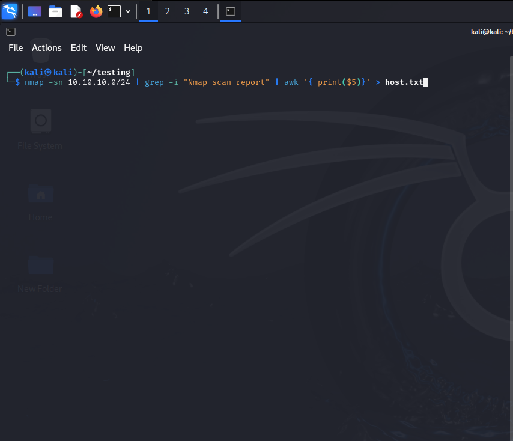
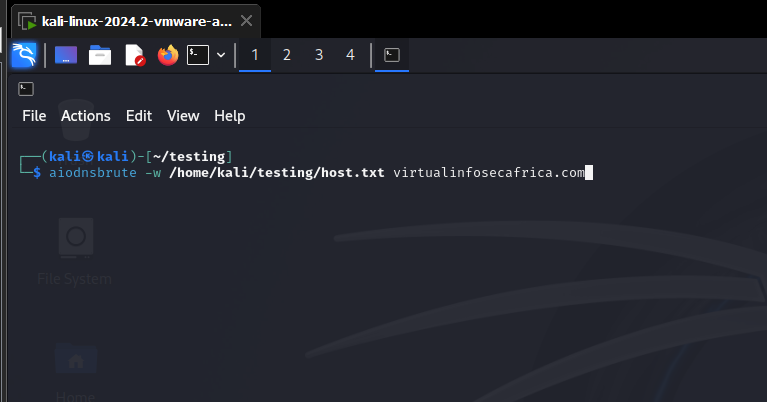
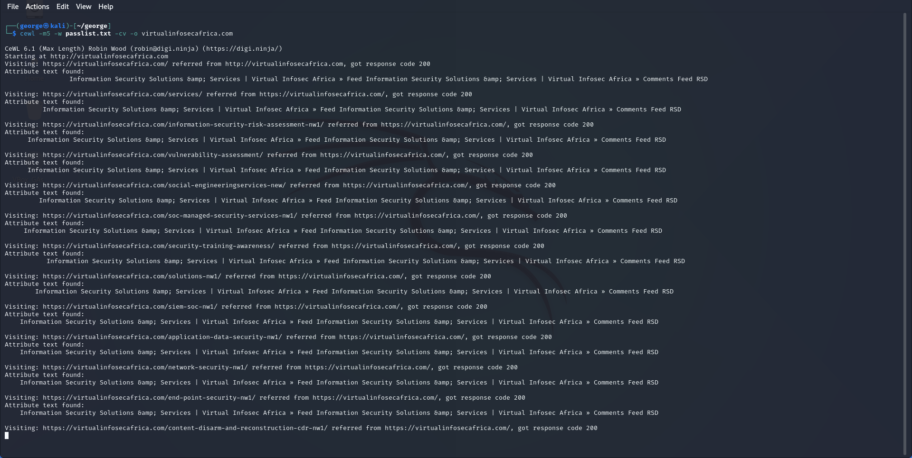
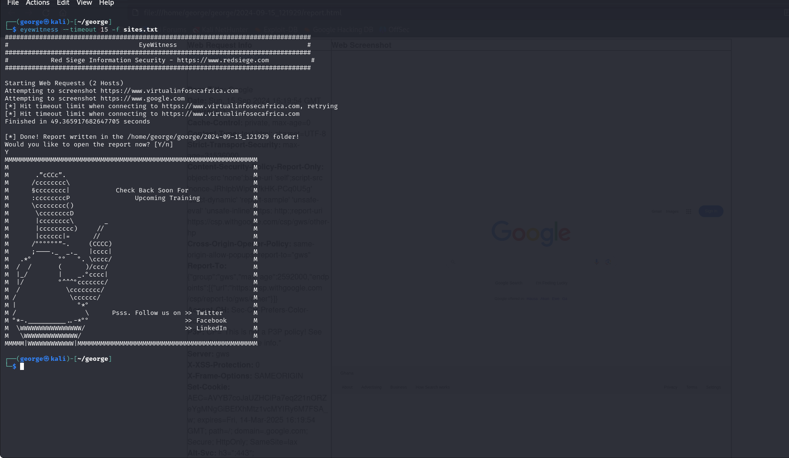
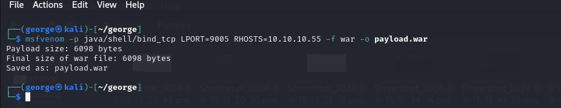
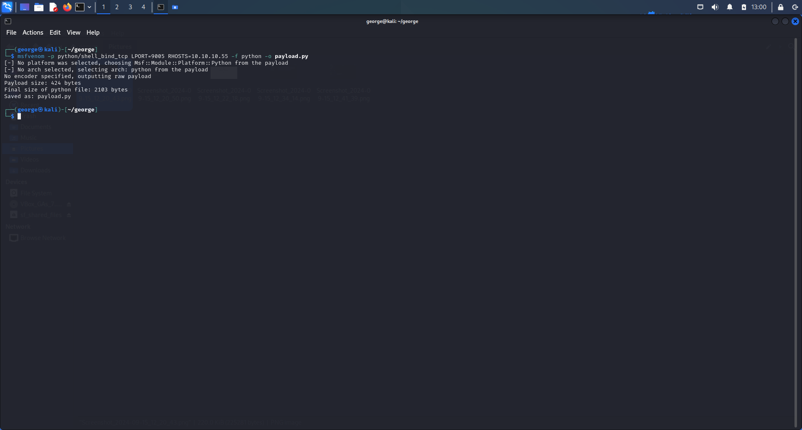
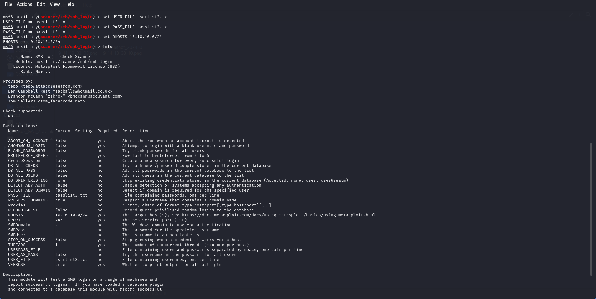
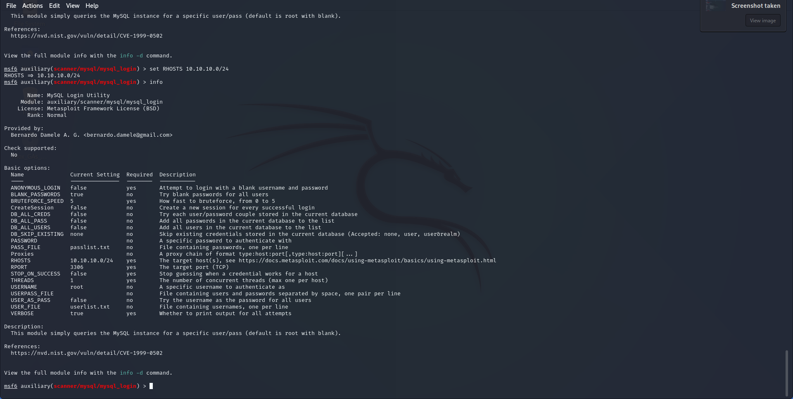
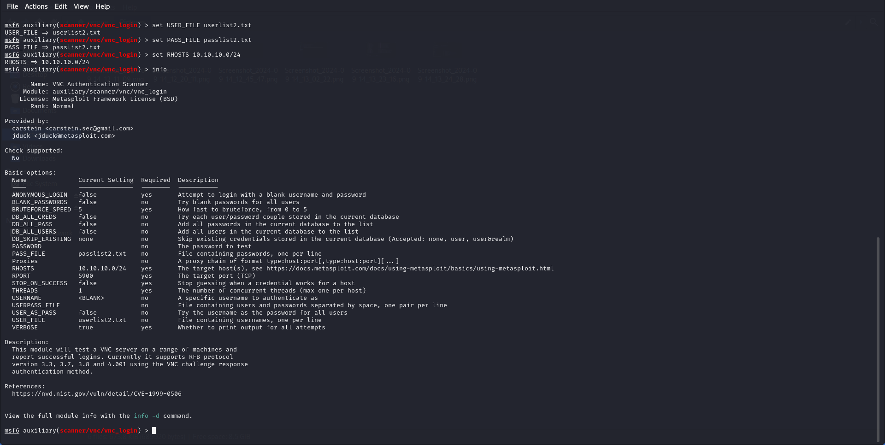
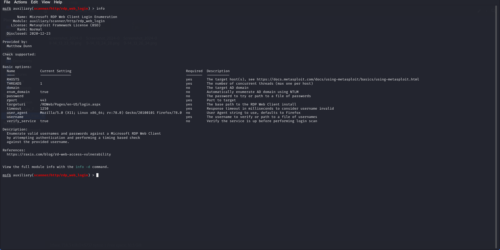

## Internal Network Penetration Testing

## For: Virtual Infosec Africa

 

## Submitted By: Cyberlab Internship

## Table of Contents

Table of Contents

Executive Summary

Analysis of Overall Security Posture

Key Recommendations

Testing Methodology

Summary Findings

Detailed Findings

Path Traversal and File Disclosure Vulnerability

Vulnerability in the MySQL Server Product of Oracle MySQL

Wordfence

Remote Desktop Protocol (RDP) Use-After-Free Vulnerability

CVSS v3.0 Reference Table
# Executive Summary

Between September 13th and September 15th, 2024, Cyberlab Internship executed an internal penetration test on the network segment 10.10.10.0/24, as provided by Virtual Infosec Africa. This report outlines the findings from the penetration test, reflecting the current network security posture of the 10.10.10.0/24 range. Detailed insights and results from the assessment are discussed in the following sections.
# Analysis of Overall Security Posture

The internal security risk for Virtual Infosec Africa is assessed as High. This assessment is primarily driven by the significant risk associated with the Remote Desktop Protocol (RDP) Use-After-Free Vulnerability. This vulnerability can be exploited remotely via RDP without requiring any user interaction or authentication, making it particularly hazardous, especially if RDP is exposed to the internet.

## Key Recommendations

To improve the security posture of Virtual Infosec Africa, the following measures are highly recommended:

- **Patch Management:** Ensure that all software and plugins are consistently updated with the latest security patches to protect against known vulnerabilities.
- **Access Control:** Adopt the principle of least privilege to restrict access to sensitive systems, minimizing the risk of unauthorized access.
- **Monitoring:** Implement regular log monitoring to detect unusual activity, with a focus on services such as Apache, MySQL, and RDP.
- **Security Best Practices:** Utilize security tools such as Web Application Firewalls (WAFs), intrusion detection systems (IDS), and ensure input sanitization to reduce potential attack vectors.

## Testing Methodology

The testing process began with the use of industry-standard vulnerability scanners like Nmap to identify active hosts and services within the provided IP range. The results from these scans were then manually reviewed, with hosts and services being further examined to identify any additional vulnerabilities or weaknesses.

A qualitative risk analysis was performed following the NIST Special Publication (800-30 R1) - Guide for Conducting Risk Assessments. This approach was used to assess the likelihood and potential impact of identified vulnerabilities. For a detailed explanation of how risk ratings were determined, please refer to Appendix B.

Subdomain enumeration can be effectively demonstrated using a tool such as `aiodnsbrute`. By running this tool against the domain specified within the scope, you can identify various subdomains associated with the target.

Passing a word list to perform a brute force attack using cewl

Performing Web-based attack surfaces using eyewitness and msfvenom

# Summary Findings

| **Finding**                                                      | **Severity** |
|------------------------------------------------------------------|--------------|
| Remote Desktop Protocol (RDP) Use-After-Free Vulnerability       | Critical     |
| Path Traversal and File Disclosure Vulnerability                 | High         |
| Wordfence                                                          | Medium       |
| Vulnerability in the MySQL Server product of Oracle MySQL          | Medium       |

# Detailed Findings

## Path Traversal and File Disclosure Vulnerability

- **Current Rating:** High
- **CVSS Score:** 7.5

Finding Summary

Evidence

##### Affected Resources
10.10.10.2, 10.10.10.30, 10.10.10.45, 10.10.10.55

##### Recommendations
- Upgrade to Apache HTTP Server 2.4.51 or later to fully patch the vulnerability.
- Ensure that default configuration ("require all denied") is enforced on all directories, especially those that could potentially be exposed via alias directives.
- Disable CGI scripts if they are not necessary, as they can be an entry point for remote code

##### References
https://www.cve.org/CVERecord?id=CVE-2021-41773

#####  Vulnerability in the MySQL Server product of Oracle MySQL
| Current Rating | CVSS |
|:-------------:|:----:|
| Medium | 4.9 |

##### Finding Summary

##### Evidence

# Affected Resources

- 10.10.10.5
- 10.10.10.40

# Recommendations

- **Upgrade:** It's crucial to upgrade MySQL to a version later than 5.6.49, 5.7.31, or 8.0.21 to resolve this vulnerability.
- **Monitor Privileged Users:** Restrict access for high-privileged users and keep a close watch on their activities to mitigate the risk of exploitation.
- **Apply Network Security Measures:** Limit network access to the MySQL server to trusted hosts only, minimizing the attack surface.

# References

https://www.cve.org/CVERecord?id=CVE-2020-14812

# Wordfence

- **Current Rating:** Medium
- **CVSS Score:** 6.4

# Finding Summary

The vulnerability associated with Wordfence has been rated as Medium with a CVSS score of 6.4. This rating indicates a moderate level of risk, which suggests that while the vulnerability is not critical, it still poses a significant threat that should be addressed to enhance overall security.

Evidence

Affected Resources

10.10.10.10

# Recommendations for Wordfence Vulnerability

- **Update the Plugin:** Make sure to upgrade to the latest version of Wordfence that addresses this vulnerability, especially if a patch has been released after version 5.3.2.
- **Sanitization and Escaping:** Developers should sanitize all user input, such as image URLs, before storing it and ensure proper escaping before displaying it to prevent XSS attacks.
- **Limit User Permissions:** Restrict access for users with elevated roles, like contributors or authors, and adhere to the principle of least privilege to reduce the risk of exploitation.
- **Use Security Plugins:** Implement additional WordPress security plugins designed to detect and prevent XSS attacks.
- 
### References

https://www.cve.org/CVERecord?id=CVE-2024-0837

##### Remote Desktop Protocol (RDP) Use-After-Free Vulnerability
**Current Rating:**

- **CVSS Score:** Critical (9.8)

Finding Summary

Evidence

Affected Resources
10.10.10.11, 10.10.10.31, 10.10.10.60

Recommendations

Apply the MS12-020 security patch provided by Microsoft.
Disable RDP if not necessary, or restrict RDP access to trusted networks using firewalls.

References

https://www.exploit-db.com/exploits/18606

# CVSS v3.0 Reference Table

| Qualitative Rating | CVSS Score |
|--------------------|------------|
| None informational | N/A        |
| Low                | 0.1-3.9    |
| Medium             | 4.0-6.9    |
| High               | 7.0-8.9    |
| Critical           | 9.0-10.0   |
